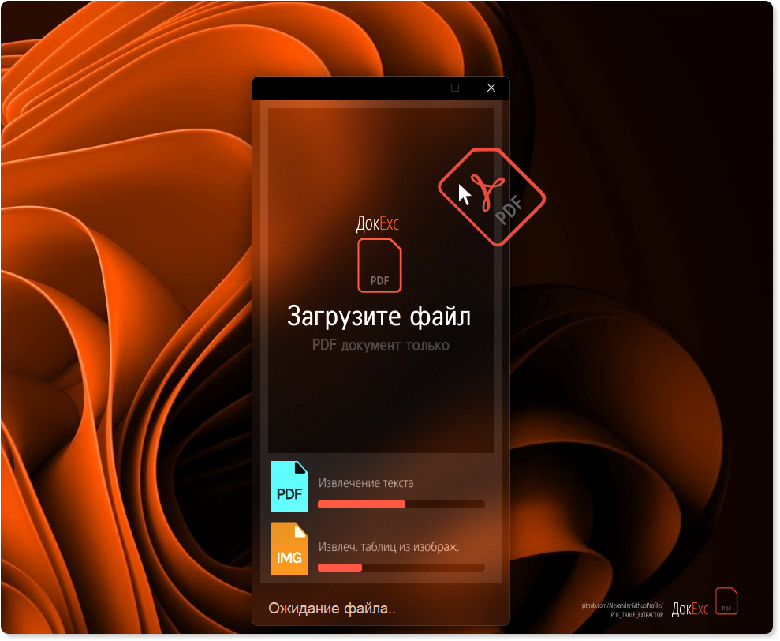
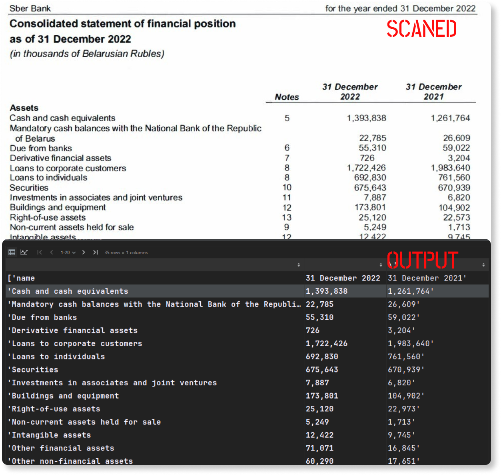
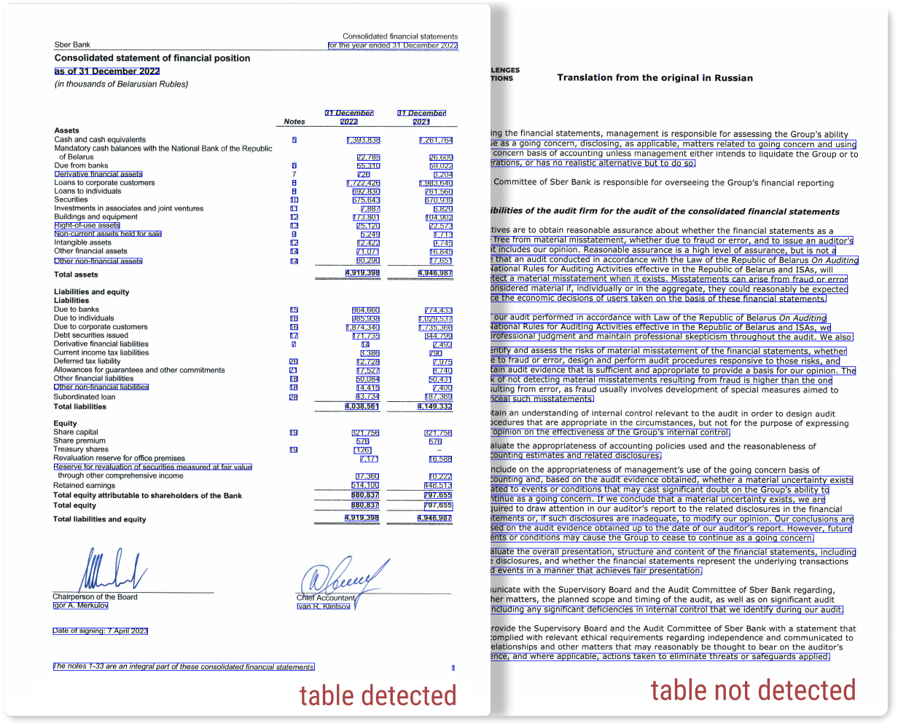
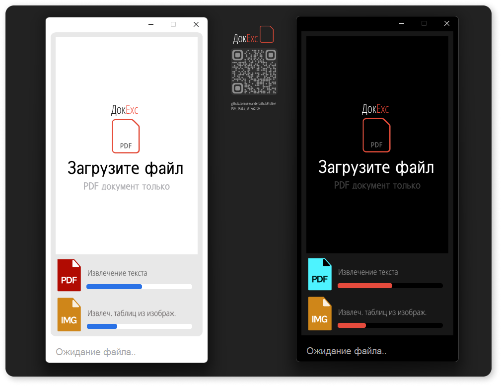

#  PDF Table Extractor: Text & Scans
- Приложение для извлечения таблиц из PDF финансовых отчетов (текст и сканы).
- Основные модули расположены в [**utils_img_processing.py**](./utils_img_processing.py), [**utils_img_table_detection**](./utils_img_table_detection.py) и GUI в [**service_gui**](./service_gui.py).
  
[English](./README_en.md) | [**Русский**](./README.md)

<p align="center">
 
</p>

## Использование
Удобная загрузка и авто-организация файлов:
> - Drag & Drop интерфейс с линией прогресса и строкой логов, доступен светлый и темный режим интерфейса
> - Модуль обнаружения оглавления и реального номера страницы, точное распознавание, предобработка данных в GPT
> - На изображениях делается пометка "обнаружена таблица" для контроля точности
> - Авто-открытие результатов

## Применяемые технологии
Применен PyTesseract для извлечения данных изображений, DBSCAN от scikit-learn для идентификации таблиц через анализ кластеров-отступов на странице. Предварительная обработка данных осуществляется GPT, а интерфейс выполнен на Tkinter. 
> - **[tkinter](https://docs.python.org/3/library/tkinter.html)**:  GUI toolkit для Python.
> - **[fitz](https://pymupdf.readthedocs.io/en/latest/)**: библиотека для работы с PDF.
> - **[tabula](https://tabula-py.readthedocs.io/en/latest/)**: библиотека для извлечения таблиц из PDF.
> - **[pdfplumber](https://github.com/jsvine/pdfplumber)**: библиотека для работы с PDF и извлечения текста.
> - **[pytesseract](https://github.com/madmaze/pytesseract)**: библиотека для распознавания текста на изображениях.
> - **[numpy](https://numpy.org/)**: библиотека для работы с массивами данных.
> - **[Pillow](https://python-pillow.org/)**: библиотека для работы с изображениями.
> - **[scikit-learn](https://scikit-learn.org/stable/)**: библиотека для машинного обучения и кластеризации данных.

## 
<p align="center">
   
</p>

## Структура проекта
- `main.py`: основной модуль приложения
- `service_gui.py`: модуль GUI интерфейса
- `utils_data_extract.py`: извлечение оглавления и идентификацию таблиц, извлечение текст-таблиц
- `utils_image_processing.py`: извлечение текста из изображений
- `utils_image_table_detection.py`: модуль для обработки изображений и обнаружения таблиц
  
##

<p align="center">
   
   
</p>


## Начало работы
- **Клонируйте репозиторий, установите зависимости и запустите модуль GUI [**service_gui**](./service_gui.py)**

```bash
# Клонирование репозитория
git clone https://github.com/YourGithubProfile/DocVision.git

# Установите зависимости
pip install -r requirements.txt
```

- **Запустите приложение**
```bash
# Запустите интерфейс
python service_gui.py
```
<p align="center">
   
   
</p>
