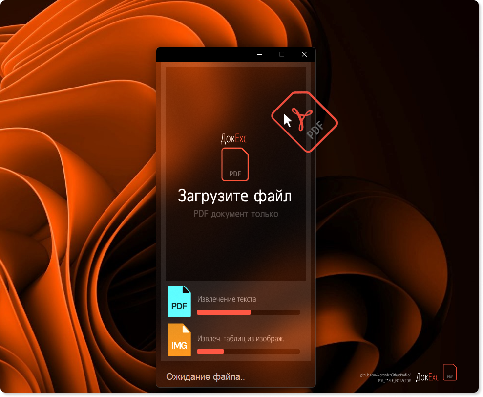

# PDF Table Extractor: Text & Scans
- An application for extracting tables from PDF financial reports (text and scans).
- Main modules are located in [**utils_img_processing.py**](./utils_img_processing.py), [**utils_img_table_detection**](./utils_img_table_detection.py), and the GUI in [**service_gui**](./service_gui.py).
  
[**English**](./README_en.md) | [Русский](./README.md)

<p align="center">
 
</p>

## Usage
Convenient file upload and auto-organization:
> - **Drag & Drop interface with progress bar and log line, available in both light and dark modes**
> - **Table of contents detection module and real page number for accurate saving**
> - **Images are marked with "table detected" for accuracy control**
> - **Auto-opening of results**

## Applied Technologies
PyTesseract is used for data extraction from images, DBSCAN from scikit-learn for table identification through cluster-indent analysis on the page. Data preprocessing is done using GPT, and the interface is implemented in Tkinter.
> - **[tkinter](https://docs.python.org/3/library/tkinter.html)**: GUI toolkit for Python.
> - **[fitz](https://pymupdf.readthedocs.io/en/latest/)**: library for working with PDFs.
> - **[tabula](https://tabula-py.readthedocs.io/en/latest/)**: library for extracting tables from PDFs.
> - **[pdfplumber](https://github.com/jsvine/pdfplumber)**: library for working with PDFs and extracting text.
> - **[pytesseract](https://github.com/madmaze/pytesseract)**: library for text recognition in images.
> - **[numpy](https://numpy.org/)**: library for working with arrays of data.
> - **[Pillow](https://python-pillow.org/)**: library for working with images.
> - **[scikit-learn](https://scikit-learn.org/stable/)**: library for machine learning and data clustering.

## 
<p align="center">
   
</p>

## Project Structure
- `service_gui.py`: GUI module.
- `main.py`: main module for processing PDF files.

- `utils_data_extract.py`: extracting table of contents and identifying tables, extracting text-tables.
- `utils_image_processing.py`: extracting text from images.
- `utils_image_table_detection.py`: module for processing images and detecting tables.
  
##

<p align="center">
   
</p>

## Getting Started
- **Clone the repository, install dependencies, and run the GUI module [**service_gui**](./service_gui.py)**

```bash
# Clone the repository
git clone https://github.com/YourGithubProfile/DocVision.git

# Install dependencies
pip install -r requirements.txt
```

- **Run the application**
```bash
# Start the interface
python service_gui.py
```
<p align="center">
   
</p>